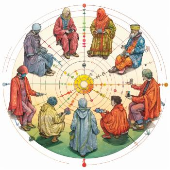

# Covalence

*Enabling scalable allocation of value.*

How does it works? A group selects its methodology of valuation, optionally private (leveraging [homorphic encryption](https://en.wikipedia.org/wiki/Homomorphic_encryption)). Members and oracles participate in the methodology, optionally over multiple rounds, which will determine a valuation. The outputs can also be fully or partially private, or public.

It comes with a web app for ease of use and for custom deployment.

It enables:
- Ownership tables for assets such as music and movies, open source projects
- New models of captable management for corporations / DAOs
- Fund accounting waterfall distribution
- Dynamic oracle-driven incentive mechanics for revenue share, royalties, etc

## How to contribute

We're looking for:

- technical contributors on various aspects: mechanism design, system design, Solidity+fhEVM programming, frontend, etc
- funding to empower contributors to work on the project

If interested, please reach out via email o@orpheuslummis.info, Matrix @orpheus:beeper.com, or [schedule a a call](https://calendly.com/orpheuslummis/discussion30min).

All contributions are rewarded by valuations *determined by the contributors group, using Covalence*.
